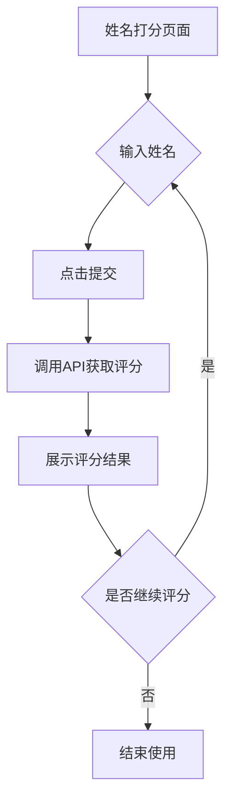

## 1. 产品概述

姓名打分页面是一个娱乐性质的工具页面，用户输入姓名后可以获取姓名的评分和详细解析。该页面通过调用第三方API获取姓名评分数据，为用户提供有趣的姓名分析结果。

目标用户：对姓名学感兴趣、希望了解姓名寓意的普通用户。

## 2. 核心功能

### 2.1 用户角色

| 角色   | 注册方式 | 核心权限            |
| ---- | ---- | --------------- |
| 普通用户 | 无需注册 | 使用姓名打分功能，查看评分结果 |

### 2.2 功能模块

姓名打分页面包含以下核心模块：

1. **姓名输入区**：输入框、提交按钮
2. **评分展示区**：综合评分、详细解析、五格分析
3. **娱乐提示**：显示结果仅供娱乐的免责声明

### 2.3 页面详情

| 页面名称   | 模块名称   | 功能描述                            |
| ------ | ------ | ------------------------------- |
| 姓名打分页面 | 姓名输入模块 | 提供姓名输入框，支持2-10个字符的中文姓名输入，包含提交按钮 |
| 姓名打分页面 | 评分展示模块 | 显示综合评分（0-100分）、姓名简批、详细描述、总批结果   |
| 姓名打分页面 | 五格分析模块 | 展示天格、地格、人格、总格、外格的评分和解析          |
| 姓名打分页面 | 基础信息模块 | 显示姓名总笔画数、各字笔画、五行属性、三才配置         |
| 姓名打分页面 | 娱乐提示模块 | 显示"本次测算结果仅供娱乐使用"的免责声明           |

## 3. 核心流程

用户操作流程：

1. 用户进入姓名打分页面
2. 在输入框中输入姓名（支持中文）
3. 点击提交按钮发送请求
4. 页面展示评分结果和详细解析
5. 用户可重新输入其他姓名进行评分

## 4. 用户界面设计

### 4.1 设计风格

* **主色调**：深蓝色（#1e40af）配合白色背景

* **按钮样式**：圆角矩形，蓝色渐变背景

* **字体**：系统默认字体，标题18px，正文14px

* **布局风格**：卡片式布局，垂直居中排列

* **图标风格**：使用简洁的线性图标

### 4.2 页面设计概述

| 页面名称   | 模块名称 | UI元素                       |
| ------ | ---- | -------------------------- |
| 姓名打分页面 | 输入区域 | 圆角输入框，占位文字"请输入您的姓名"，蓝色提交按钮 |
| 姓名打分页面 | 评分展示 | 大字体显示综合评分（红色或绿色），卡片式结果展示   |
| 姓名打分页面 | 详细信息 | 分栏展示五格分析，使用表格或卡片分组显示       |
| 姓名打分页面 | 娱乐提示 | 底部灰色小字体显示免责声明              |

### 4.3 响应式设计

* **桌面端**：内容宽度限制在800px以内，居中显示

* **移动端**：全屏宽度，垂直堆叠布局，字体适当放大

* **触摸优化**：按钮和输入框高度不小于44px，

