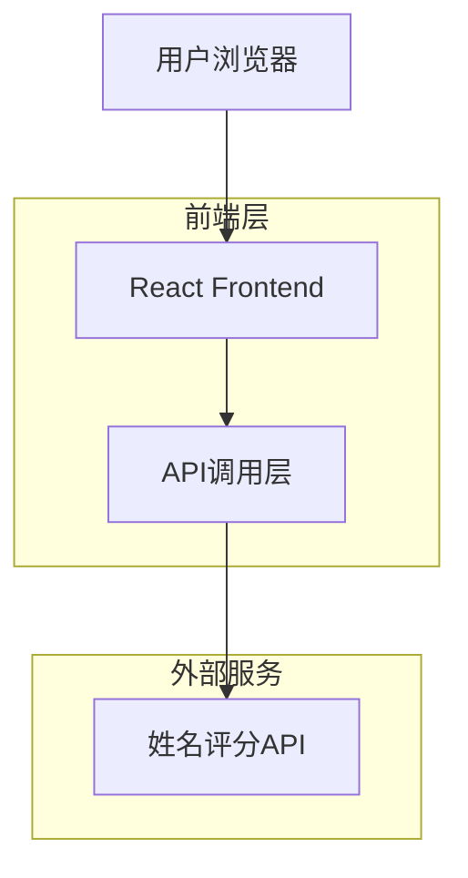
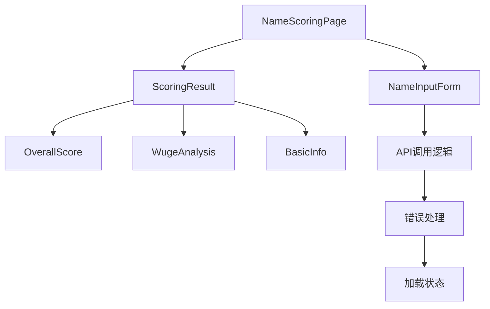

## 1. 架构设计



## 2. 技术描述

- **前端框架**: React@18 + TypeScript
- **样式方案**: Tailwind CSS@3
- **构建工具**: Vite
- **HTTP客户端**: Axios
- **状态管理**: React Hooks (useState/useEffect)
- **初始化工具**: vite-init
- **后端服务**: 无（直接调用第三方API）

## 3. 路由定义

| 路由 | 用途 |
|------|------|
| /name-scoring | 姓名打分页面，提供姓名输入和评分展示功能 |
| / | 主页（如需要可重定向到姓名打分页面） |

## 4. API定义

### 4.1 姓名评分API接口

```
GET https://api.yuanfenju.com/index.php/v1/Dafen/xingming
```

请求参数（Query Parameters）：
| 参数名 | 参数类型 | 是否必需 | 描述 |
|--------|----------|----------|------|
| api_key | string | true | API密钥，从环境变量读取 |
| name | string | true | 待评分的姓名 |

请求示例：
```
GET https://api.yuanfenju.com/index.php/v1/Dafen/xingming?api_key=sXFpwpk5qCwWSA8fU0i5IW4ic&name=张三
```

响应数据结构（TypeScript类型定义）：
```typescript
interface NameScoringResponse {
  errcode: number;
  errmsg: string;
  notice: string;
  data: {
    name: string;
    count: number;
    description: {
      score: string;
      title: string;
      description: string;
    };
    jixiong: string;
    bihua: number[];
    wuxing: string[];
    天格: number;
    天格描述: {
      desc: string;
      xiongji: string;
      desc1: string;
      score: string;
    };
    地格: number;
    地格描述: {
      desc: string;
      xiongji: string;
      desc1: string;
      score: string;
    };
    人格: number;
    人格描述: {
      desc: string;
      xiongji: string;
      desc1: string;
      score: string;
    };
    总格: number;
    总格描述: {
      desc: string;
      xiongji: string;
      desc1: string;
      score: string;
    };
    外格: number;
    外格描述: {
      desc: string;
      xiongji: string;
      desc1: string;
      score: string;
    };
    三才: string;
  };
}
```

## 5. 环境变量配置

需要在项目根目录创建 `.env` 文件：

```
VITE_NAME_SCORING_API_KEY=sXFpwpk5qCwWSA8fU0i5IW4ic
VITE_NAME_SCORING_API_URL=https://api.yuanfenju.com/index.php/v1/Dafen/xingming
```

注意：
- API密钥通过环境变量读取，不会硬编码在代码中
- `.env` 文件需要添加到 `.gitignore` 中，避免提交到代码仓库
- 使用 `import.meta.env` 在Vite项目中访问环境变量

## 6. 组件架构



## 7. 响应式设计实现

使用Tailwind CSS的响应式工具类：
- 移动端优先（默认样式针对移动设备）
- 平板设备：`md:` 前缀
- 桌面设备：`lg:` 前缀
- 断点设置：移动端（<768px）、平板（768px-1024px）、桌面（>1024px）